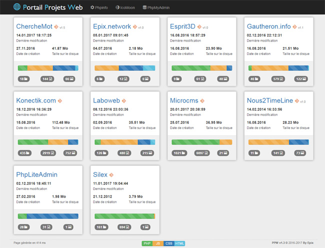

PPW (Portail Projets Web)
=========================

Introduction
------------
PPW est un portail Web réalisé en Php, générant automatiquement un tableau de bord sous forme de tuiles pour l'ensemble des dossiers projets d'une arborescence donnée.

Fonctionnalités
---------------
En entête, on trouve 3 liens :
- Accès au PhpInfo du serveur
- Accès à la bibliothèque d'icones : IcoMoon
- Accès à PhpMyAdmin (si la configuration a été réalisé)

Pour chaque dossier de projet une tuile est générée avec :
- Le nom de projet
- S'il est suivi en Git avec la version si elle existe
- Date de création du projet
- Date de dernière modification
- Taille du projet sur le disque
- Barre visuelle indiquant la proportion de fichier (PHP/JS/CSS/HTML)
- Le nombre total de dossiers
- Le nombre total de fichiers
- Le nombre d'images (et en survol la répartition entre Jpg/Png/Gif)

En pied de page on retrouve le temps de génération de la page ainsi que la légende permettant de retrouver le type de langage en fonction de son code couleur.

L'ensemble est en responsive design basé sur le Framework Bootstrap.

Installation
------------
Copier le repo sur votre serveur web puis configurer le dossier des projets à parcourir.

Configuration
-------------
Tout se passe dans `include\config.inc.php`

- `URL_ADMIN_BDD` : url du PhpMyAdmin. Le bouton ne s'affiche pas si le paramètre est vide.
- `DOSSIER_PROJETS` : chemin d'arborescence des projets à traiter.
- `TIME_ZONE_SERVER` : Fuseau horaire du serveur. Sert pour la gestion des heures.

Licence GNU/GPLv2.1
--------------------
PPW is free software; you can redistribute it and/or
modify it under the terms of the GNU Lesser General Public
License as published by the Free Software Foundation; either
version 2.1 of the License, or any later version.

PPW is distributed in the hope that it will be useful,
but WITHOUT ANY WARRANTY; without even the implied warranty of
MERCHANTABILITY or FITNESS FOR A PARTICULAR PURPOSE.
See the GNU Lesser General Public License for more details.

You should have received a copy of the GNU Lesser General Public
License along with PPW; if not, write to the 
Free Software Foundation, Inc., 
51 Franklin St, Fifth Floor, Boston, MA 02110-1301 USA

